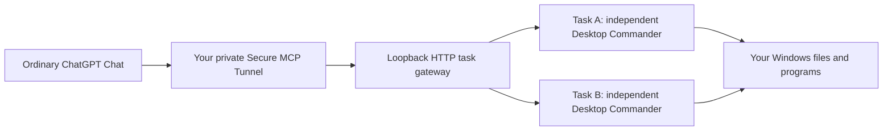

# ChatGPT Local Files

**Let ordinary ChatGPT Chat read, edit, run commands, and save files on your own Windows computer.**

[](LICENSE)
[](docs/SETUP.en.md)
[](https://github.com/jayhigh425/chatgpt-local-files/archive/refs/heads/main.zip)
[](https://github.com/jayhigh425/chatgpt-local-files/actions/workflows/validate.yml)

**English** · [简体中文](README.zh-CN.md) · [Download](https://github.com/jayhigh425/chatgpt-local-files/archive/refs/heads/main.zip) · [Examples](docs/EXAMPLES.md) · [Setup guide](docs/SETUP.en.md)


Ask ChatGPT to find research notes, edit a local document, run an installed script, or save a result to your disk. This open-source setup kit connects ChatGPT Chat to [Desktop Commander](https://github.com/wonderwhy-er/DesktopCommanderMCP) through [OpenAI Secure MCP Tunnel](https://developers.openai.com/api/docs/guides/secure-mcp-tunnels), with a local task gateway for concurrent work.

**Inference stays in your ChatGPT Chat session. The kit makes no model API calls and does not ask you to recharge API credits.** A tunnel-only runtime credential is required. Your account must expose the required tunnel and custom MCP/plugin features; availability and future platform pricing are outside this project's control.

## What you can do

| Capability | How it works |
| --- | --- |
| Read and search local files | Return file contents to ChatGPT through local tools. This does not automatically upload binary documents into ChatGPT's file/code environment. |
| Edit and save results | Changes and generated outputs are saved directly on your computer. |
| Run local programs | Use installed command-line tools as the current Windows user. |
| Work across several chats | Separate task processes, configurations, terminal buffers, search state, and working directories. |
| Handle competing file edits | Detect stale saves; reread and merge. Commit working copies with a backup of the previous target. |
| Continue long operations | Receive an operation ID promptly, query progress, and recover the ID after an HTTP disconnect using a request key. |
| Keep the connection running | Hidden event-driven supervision and a native no-console guardian; verify the live tunnel target when reconnecting. |
| Inspect local status | Open the local dashboard for connection, task, operation and safe RPC outcome records. |
| Configure another computer | Give the public kit to that person's Codex. Each user creates their own private connection. |

Full mode supports the current user's accessible filesystem and commands, including an entire drive. It does not grant administrator privileges. Restricted mode narrows file-tool paths; command tools are not an OS sandbox. See [security boundaries](SECURITY.md).

**Current source kit: v1.2.1.** Download the main-branch ZIP for this version. Earlier tagged releases remain available in [Releases](https://github.com/jayhigh425/chatgpt-local-files/releases). Existing installations should follow [UPGRADING.md](docs/UPGRADING.md).

## Quick start

1. [Download the latest release](https://github.com/jayhigh425/chatgpt-local-files/archive/refs/heads/main.zip), extract the complete ZIP, and keep its folder structure.
2. Give the extracted directory to **your own Codex**, together with this prompt:

```text
Read this kit's AGENTS.md, SKILL.md, README.md, and docs/SETUP.en.md.
Configure Local Computer Assistant on my Windows computer so ordinary
ChatGPT Chat can read, edit, and save local files and run local commands.
I authorize access to all files and commands available to my current
Windows user, and Allow all tools for this plugin. Use my own account
and private tunnel. Use ChatGPT Chat for inference; do not call model
APIs, recharge API credit, or buy third-party services. I authorize
hidden background startup at login. Keep credentials out of chat,
logs, and shareable files. Verify actual ordinary Chat read/write/edit
behavior and local output before reporting setup complete.
```

3. Complete login or human verification yourself when needed. After configuration, use a **new ordinary Chat** with your own plugin enabled.

Prefer a narrower file scope? Replace the full-access sentence with your chosen folders and request Restricted mode. Each person's authorization and credentials belong to them.

### Manual local install

Windows 10/11 x64, internet, and access to the required account features are prerequisites. Run from the kit root after authorizing your chosen scope:

```powershell
powershell -NoProfile -ExecutionPolicy Bypass -File .\scripts\Install-LocalAssistant.ps1 -AccessMode Full
```

This installs local tools. Continue with the [account connection and real Chat verification](docs/SETUP.en.md); local installation alone is not a completed ChatGPT connection.

The default installed runtime is `%LOCALAPPDATA%\ChatGPTLocalAssistant`. Keep it private. Share this repository or release ZIP, never the installed runtime.

## Try it in Chat

After setup, select your Local Computer Assistant plugin and try:

> Search D:\Research for relevant notes, summarize them with local filenames, and save the result as D:\Research\summary.md.

> Read D:\Projects\notes.md, improve the wording, preserve headings, and save it. If the file changed, reread and merge. Verify the saved content.

> Run my installed script on disposable input. Return its PID, poll progress, and put outputs in the task work directory. Use commit_file when writing a working copy back to an existing file.

More [English and Chinese examples](docs/EXAMPLES.md).

## How it works



The original 26 Desktop Commander tools remain, with 10 gateway tools (36 total):

| Tool | Purpose |
| --- | --- |
| `begin_task`, `end_task` | Create and close this chat's isolated task. |
| `get_capabilities` | Read live runtime version, tool count, dependencies and limitations without starting a task. |
| `commit_file` | Publish a working copy after checking the target version, retaining the previous target as a backup. |
| `get_operation`, `task_status` | Query background operations and recover a submitted request by its request key. |
| `prepare_file_edit`, `commit_file_edit` | Create guarded working copies and publish after file-version checks. |
| `run_file_task` | Run a local script in the background and optionally publish guarded working copies. |
| `save_chatgpt_file` | Download a ChatGPT-provided HTTPS file object to the local computer. |

Subsequent local calls carry their own `task_id`. Slow operations return an operation ID after about 900 ms while work continues; an HTTP disconnect does not cancel them. Reuse a request key only for the same arguments. Query progress with `get_operation`; an old tool catalogue can use `read_file` with `local-assistant://operations/<operation ID>`.

File tools detect stale saves. Arbitrary command writes can bypass these checks. Files in one edit are published individually, not as a cross-file transaction. Tasks and operations are not restored after a gateway restart.

**Binary transfer is not yet complete in both directions.** Local Word/Excel/PDF files are not automatically mounted in ChatGPT's file/code environment. The return-file interface exists and has synthetic download/conflict tests, but a real ChatGPT-generated binary round trip has not been verified. For visual quality checks, generate/render/view in ChatGPT's own environment and report what was actually inspected. See [current runtime behavior](docs/RUNTIME.md).

## FAQ

**Does this spend model API credit?** The kit does not call model APIs. ChatGPT Chat supplies inference. You still create a runtime credential with Tunnels Read/Use only. The kit does not purchase services or guarantee future OpenAI pricing.

**Does it work on every ChatGPT account?** No. Required tunnel and custom MCP/plugin features must be available to the account and workspace. Check the live official interface before assuming eligibility.

**Can it replace every Codex or Work feature?** It provides local file and command tools to ordinary Chat. It does not reproduce the full Codex/Work product, give administrator rights, or provide complete screen control.

**Are my files entirely processed offline?** No. Tool results are supplied to ChatGPT in the cloud. The gateway is local, but the chat and private tunnel require internet. Choose the files you ask Chat to process accordingly.

**Can I share my configured plugin?** Share the public kit. Others create their own tunnel, credential, and private plugin. This is not a shared remote computer or a public plugin-store listing.

**What has been tested?** Installation, concurrency, request disconnect recovery, idempotent operations, local status protection, synthetic artifact saves and diagnostics privacy. The maintainer's private deployment also passed cloud tool calls, live tunnel rebinding and native guardian recovery. Each new installation still needs its own ordinary Chat acceptance test. New users must pass their own acceptance test. See [VALIDATION.md](VALIDATION.md).

## Project files

- [SKILL.md](SKILL.md): deployment instructions for Codex.
- [English setup](docs/SETUP.en.md), [Chinese account setup](references/account-setup.md), [troubleshooting](references/troubleshooting.md).
- `runtime/`: task gateway, credentials, startup, health, stopping, and Chat verification.
- `scripts/`: installation, concurrency verification, and public-package privacy checks.
- `assets/`: pinned dependency lockfile and official download hashes.
- [PRIVACY-AUDIT.md](PRIVACY-AUDIT.md), [SHA256SUMS.txt](SHA256SUMS.txt): public package checks and integrity manifest.
- [CHANGELOG.md](CHANGELOG.md), [CONTRIBUTING.md](CONTRIBUTING.md), [SECURITY.md](SECURITY.md).

## Help the project improve

If it works for you, a star or a link to your verified workflow helps others find it. Report redacted setup problems, improve the guides, or contribute a reproducible fix. Never upload credentials, private account identifiers, logs containing personal data, or user documents to issues.

Built on [Desktop Commander](https://github.com/wonderwhy-er/DesktopCommanderMCP), [OpenAI tunnel-client](https://github.com/openai/tunnel-client), and the [MCP TypeScript SDK](https://github.com/modelcontextprotocol/typescript-sdk). This independent community project is not an official OpenAI product. Original kit code and guides are [MIT licensed](LICENSE); upstream dependencies retain their licenses.