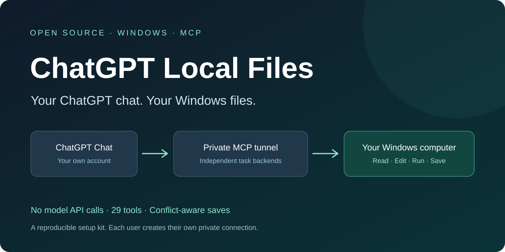

# ChatGPT Local Files · 本地电脑助手

**让普通 ChatGPT Chat 读取、修改和保存 Windows 本地文件，并运行本机命令。**

[English](README.md) · **简体中文** · [下载最新版](https://github.com/jayhigh425/chatgpt-local-files/archive/refs/heads/main.zip) · [使用示例](docs/EXAMPLES.md) · [版本记录](CHANGELOG.md)



这个开源部署包不调用模型 API、不要求充值 API 余额；推理由你的普通 ChatGPT Chat 完成。接入仍需要只授予 Tunnels Read/Use 的运行密钥，以及账号实际具有隧道和自定义 MCP 插件能力。未来平台政策以官方说明为准。

让普通 ChatGPT Chat 通过开源 Desktop Commander 与 OpenAI Secure MCP Tunnel 处理接收者自己的 Windows 文件。此包分享的是部署方法，每个人独立安装、创建自己的隧道和私有插件；不是共用某人的插件、电脑或密钥。

**当前源码部署包：v1.2.1。** 上方下载链接指向当前 main 分支；历史版本仍在 [Releases](https://github.com/jayhigh425/chatgpt-local-files/releases)。已有安装按 [升级说明](docs/UPGRADING.md) 更新。

## 给接收者的用法

解压整个 ZIP，保留文件结构，把下面这段话和解压目录交给自己的 Codex：

> 请阅读这个部署包的 AGENTS.md、SKILL.md 和 README.md，按说明在我的 Windows 电脑上配置“本地电脑助手”，让普通 ChatGPT Chat 能读取、修改并保存本地文件。我同意开放当前 Windows 用户可访问的全部文件系统和本机命令，并将这个插件的 ChatGPT 权限设为“允许使用所有工具”。只使用 ChatGPT 订阅额度，不调用付费模型 API，不充值。我同意配置登录后后台启动。请使用我自己的账号和新建的连接凭据，密钥不要出现在聊天、日志或可分享文件中。完成普通 Chat 的实际读写验收后再报告成功。

如果只想开放某些目录，把“全部文件系统和本机命令”替换为具体目录，并选择 Restricted 模式。原分享者的授权不会替代接收者本人的授权。

想支持整个 D 盘，可以选择 Full，或将文件工具的指定目录设为 `D:\`。Full 允许访问当前 Windows 用户可访问的文件和命令，不自动获得管理员权限。

Restricted 只设置文件工具的目录范围，命令工具仍按当前用户权限运行，不是系统隔离沙箱。需要严格隔离时应采用独立系统用户或虚拟机。

## 多任务并发

v1.2.1 使用本机 HTTP MCP 网关：每个 Chat 任务先调用 begin_task，随后带自己的 task_id。各任务使用独立 Desktop Commander 进程、配置、工作目录及进程/搜索状态；原有 26 个工具保留，网关增加 10 个工具，共 36 个；get_capabilities 可以查询真实版本和能力。长命令先返回 PID，之后分次读取输出。同一文件写入由网关协调并校验读取后的版本，旧内容不能静默覆盖新的修改。

Full 模式继续开放全盘和命令。使用脚本修改已有文件时，先在任务目录生成工作副本，再用 commit_file 写回；该工具会检查目标版本并保留旧文件备份。任意本机命令仍可直接改文件，不能声称这些绕过网关的写入也绝对无冲突。版本协调不是权限沙箱。

完成任务及其进程后调用 end_task；输出和备份保留。空闲 24 小时且没有活动进程的任务可以回收；重启后应重新 begin_task。已有 Chat 可能缓存旧工具列表，升级时需要在插件设置刷新操作，并开启新 Chat。

## 长任务、后台连接与文件传输

- 耗时操作约 900 毫秒后先返回 operation_id，后台继续执行；使用 get_operation/task_status 查询。相同 request_key 和参数避免重复提交，HTTP 断开不会直接取消本地任务。
- 登录、恢复唤醒和进程退出事件触发恢复；原生无控制台守护避免控制台退出连带停止后台。没有每分钟健康检查，电脑仍需开机、登录、联网。
- 重连会核对隧道进程实际转发的网关地址，避免“状态正常但工具失败”。Open-Status.ps1 打开动态端口的状态页；Install-StatusShortcut.ps1 可创建桌面入口。
- **完整双向文件传输尚未实现。** 本地内容可返回聊天，但 Word/Excel/PDF 原文件不会自动进入 ChatGPT 文件/代码环境。save_chatgpt_file 已有保存接口和合成下载测试，真实云端生成文件的全流程尚未验收。
- 文档效果检查在 ChatGPT 自身环境完成，不能把本地读取文本或下载成功说成已经检查排版。网关重启不会恢复原任务；多文件发布也不是整体事务。

细节见 [运行说明](docs/RUNTIME.md) 和 [验证范围](VALIDATION.md)。

## 条件与能力

- 面向 Windows 10/11 x64。其他系统需要另写凭据保存与启动脚本。
- 需要互联网，以及接收者自己能够创建隧道、自定义 MCP 插件的 OpenAI/ChatGPT 账号。平台入口或管理员权限不具备时，安装包不能代为开通。
- 推理由普通 ChatGPT Chat 完成；本机运行文件、搜索、编辑和命令工具。运行密钥只授予 Tunnels Read/Use，不授予模型权限，不设置充值或第三方付费托管服务。此包不对未来平台价格政策作保证。
- 能访问当前 Windows 用户有权访问的文件并调用已安装程序；不会自动获得 Windows 管理员权限、完整屏幕控制或 Codex/Work 的全部功能。

## 文件入口

- `AGENTS.md`：交给 Codex 的执行边界与完成标准。
- `SKILL.md`：部署流程，可选安装为 Codex skill；直接读取就能使用，无需安装 skill。
- `references/account-setup.md`：接收者自己的隧道、密钥、插件操作。
- `scripts/Install-LocalAssistant.ps1`：安装可复现依赖、校验下载和测试本地工具。
- `runtime/`：保存密钥、启动、状态、停止、自启动和普通 Chat 验收脚本。
- `scripts/Check-ShareSafety.ps1`：检查这个公共包是否混入账号标识、凭据或私有运行文件。
- `PRIVACY-AUDIT.md`、`SHA256SUMS.txt`：本次公共包检查记录与文件校验值。

安装结果默认保存在接收者自己的 `%LOCALAPPDATA%\ChatGPTLocalAssistant`。这是**私有运行目录，不要重新打包分享**。密钥在那里用 Windows DPAPI 加密并限制文件访问；加密文件也不要分享。

## 手动运行本地安装阶段

从包的根目录运行：

```powershell
powershell -NoProfile -ExecutionPolicy Bypass -File .\scripts\Install-LocalAssistant.ps1 -AccessMode Full
```

或只授权指定目录：

```powershell
.\scripts\Install-LocalAssistant.ps1 -AccessMode Restricted -AllowedDirectories 'D:\工作资料'
```

本地安装成功还不等于 ChatGPT 接入成功。继续按 account-setup.md 配置自己的账号，完成普通 Chat 验收。登录、真人验证或二次验证需要接收者本人完成；不要把密钥发送给 Codex 聊天或分享者。

安装器的 `-ConfigHome` 参数仅用于隔离测试。常规部署不要设置它，以免改变本地程序的用户配置位置。

## 常见问题与参与

文件工具在本机运行，但工具结果会发送给云端 ChatGPT；此方案不等于全部离线处理。电脑需要保持开机、登录和联网。复杂文档或统计任务需要本机安装相应程序。它提供普通 Chat 的文件与命令能力，不完整复刻 Work/Codex 的全部功能。

安装后用新普通 Chat 选择自己的插件；可以直接说“读取这个文件，修改后保存，并重新读取检查”。更多提示见[使用示例](docs/EXAMPLES.md)。

本次已验证安装、并发隔离与一个真实普通 Chat 的读写验收，详见 [VALIDATION.md](VALIDATION.md)；新使用者必须在自己的电脑和账号上完成验收。

如果它解决了你的实际问题，欢迎 Star、分享仓库或提交脱敏问题。参与方式见 [CONTRIBUTING.md](CONTRIBUTING.md)，权限和隐私边界见 [SECURITY.md](SECURITY.md)。这是独立社区项目，不是 OpenAI 官方产品。

来源：[OpenAI 官方隧道文档](https://developers.openai.com/api/docs/guides/secure-mcp-tunnels)、[tunnel-client](https://github.com/openai/tunnel-client)、[Desktop Commander](https://github.com/wonderwhy-er/DesktopCommanderMCP)。固定版本和下载摘要见 assets/downloads.json。
